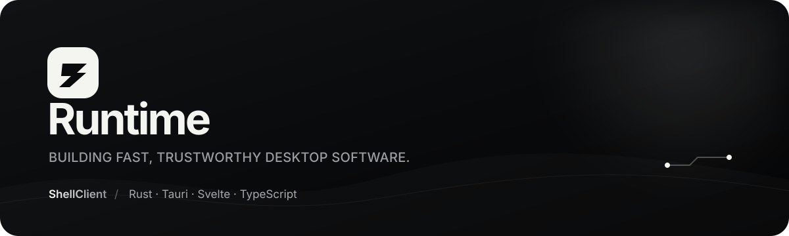

  

  <a href="https://shellclient.com"><strong>Website</strong></a>
  &nbsp;·&nbsp;
  <a href="https://github.com/RuntimeShell/ShellClient"><strong>ShellClient</strong></a>
  &nbsp;·&nbsp;
  <a href="https://discord.gg/waCPdJFs5"><strong>Discord</strong></a>

I’m **Runtime**. I build focused desktop software where speed, clear interaction and dependable engineering matter equally.

My main project is **[ShellClient](https://github.com/RuntimeShell/ShellClient)** — an open-source Minecraft launcher built with a Rust core and a polished Svelte interface. It handles accounts, isolated instances, loaders, Java runtimes, mod management, downloads, updates and the game launch lifecycle without turning routine setup into busywork.

### Currently building

- A fast native launcher core in **Rust** and **Tauri 2**.
- Clear instance and content management with **Svelte** and **TypeScript**.
- Safe Microsoft authentication and encrypted local account storage.
- Reproducible, integrity-checked releases with a SignPath-ready signing pipeline.
- Practical performance work for both modest and high-end systems.

### ShellClient

<table>
  <tr>
    <td width="68%">
      <h3>A launcher that gets out of the way.</h3>
      
Vanilla, Fabric, Forge, Quilt and NeoForge instances; automatic Java management; Modrinth content; live game logs; skins; servers; system tray support; and carefully limited offline profiles.

      
<a href="https://github.com/RuntimeShell/ShellClient"><strong>Explore the source →</strong></a>

    </td>
    <td width="32%" align="center">
      
        
      
    </td>
  </tr>
</table>

### Tools I work with

  
  
  
  
  
  

ShellClient is an independent project and is not affiliated with Mojang Studios or Microsoft.
